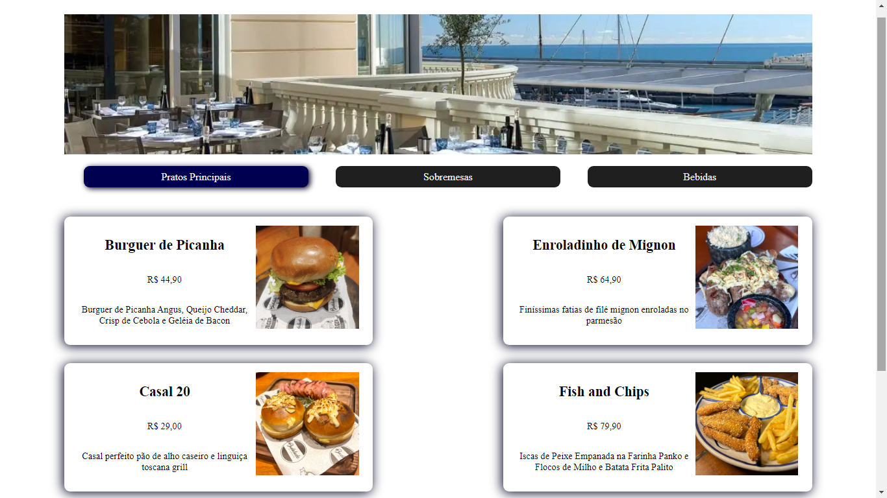

<h1 align="center"> Projeto Cardapio Digital</h1>

Cardapio Digital com botões interativos desenvolvido com JavaScript e React.

  <a href="#-tecnologias">Tecnologias</a>&nbsp;&nbsp;&nbsp;|&nbsp;&nbsp;&nbsp;
  <a href="#-projeto">Projeto</a>&nbsp;&nbsp;&nbsp;|&nbsp;&nbsp;&nbsp;
  <a href="#memo-licença">Licença</a>

  

 

  

## 🚀 Tecnologias

Esse projeto foi desenvolvido com as seguintes tecnologias:

- HTML e CSS
- JavaScript
- React
- Git e Github

## 💻 Projeto

Site criado durante o evento Intensivão de JavaScript oferecido pela Hashtag Programação.
https://www.youtube.com/@HashtagProgramacao

## :memo: Licença

Esse projeto está sob a licença MIT.
